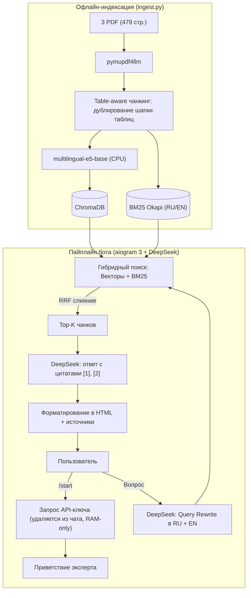

# ⚡ Telegram RAG-бот: Эксперт по электроэнергетике

Telegram-бот в формате системы «вопрос-ответ» с генеративным подходом, имитирующий отраслевого эксперта в сфере электроэнергетики. Разработан на базе **DeepSeek API** (`deepseek-chat`) и технологии **RAG** по целевым документам:
- **СиПР ЕЭС России 2025–2030** (СО ЕЭС) — 236 стр. (RU)
- **IEA Electricity 2025** — 200 стр. (EN)
- **IEA Global Energy Review 2025** — 43 стр. (EN)

---

## 🏗 Архитектура



### Ключевые решения:
1. **Table-aware чанкинг:** таблицы СиПР разбиваются с обязательным дублированием шапки колонок в каждый фрагмент.
2. **Кросс-языковой поиск:** вопрос пользователя на русском транслируется через LLM в скоординированные запросы на RU и EN, что позволяет находить данные в англоязычных отчётах IEA.
3. **Гибридный поиск (RRF):** объединение векторного поиска (`e5-base`) и лексического (`BM25`) для точного поиска терминов, напряжений (220/500 кВ) и числовых балансов.
4. **Безопасность:** ключ DeepSeek запрашивается при старте, проверяется тестовым запросом, хранится исключительно в памяти (FSM `MemoryStorage`) и сразу удаляется из переписки.

---

## 🚀 Быстрый старт

### 1. Установка

```bash
git clone https://github.com/Metrahol/energy-rag-bot.git
cd energy-rag-bot

python -m venv .venv
.\.venv\Scripts\activate   # Linux/macOS: source .venv/bin/activate
pip install -r requirements.txt
```

Создайте `.env` (на основе `.env.example`) и укажите токен Telegram:
```ini
BOT_TOKEN=your_telegram_bot_token
```

### 2. Индексация (запуск один раз)

```bash
python -m app.ingest
```
Парсит PDF-файлы из папки `data/`, рассчитывает эмбеддинги и сохраняет индекс в `storage/` (~15 минут на CPU).

### 3. Запуск бота

```bash
python -m app.main
```

Для запуска в контейнере доступен Docker:
```bash
docker compose up -d --build
```

---

## 🧪 Тестирование качества (Benchmark)

Для проверки RAG-пайплайна на 12 контрольных вопросах без Telegram (нужен `DEEPSEEK_TOKEN` в `.env`):

```bash
python -m tests.run_eval
```
Результаты прогона сохранены в [tests/eval_results.md](tests/eval_results.md).

---

## 💬 Примеры вопросов для проверки

- **СиПР ЕЭС:** *«Какой прогноз потребления электроэнергии в ЕЭС России на 2030 год?»*
- **Контекст (follow-up):** *«А какой при этом ожидается максимум потребления мощности?»*
- **IEA (кросс-поиск):** *«Какую роль играют дата-центры в росте мирового спроса на электроэнергию?»*
- **Проверка на галлюцинации:** *«Какой курс биткоина будет в 2030 году?»* (бот прямо сообщает об отсутствии данных в базе).

---

## 🛠 Стек

- **Backend & Bot:** Python 3.11, `aiogram 3`, `AsyncOpenAI` (`deepseek-chat`)
- **Поиск & RAG:** `chromadb`, `sentence-transformers` (`intfloat/multilingual-e5-base`), `rank-bm25`, `snowballstemmer`, `pymupdf4llm`
- **Инфраструктура:** Docker, `docker-compose`
