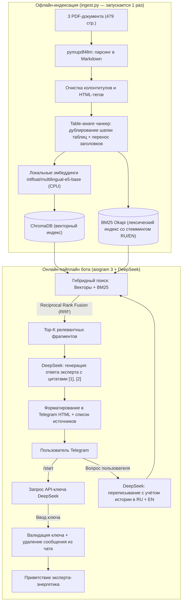

# ⚡ Telegram-бот «Эксперт по электроэнергетике» (RAG + DeepSeek)

Чат-бот в формате системы вопрос-ответ с генеративным подходом, имитирующий отраслевого эксперта в области электроэнергетики. Разработан в рамках тестового задания.

Основан на **DeepSeek API** (`deepseek-chat`) и технологии **RAG** (Retrieval-Augmented Generation) по трём целевым документам:
1. **СиПР ЕЭС России 2025–2030** (СО ЕЭС) — 236 стр., русский язык, сложные многостраничные таблицы балансов мощности и электроэнергии;
2. **IEA Electricity 2025** — 200 стр., английский язык;
3. **IEA Global Energy Review 2025** — 43 стр., английский язык.

---

## 🏗 Архитектура решения



---

## 🎯 Ключевые инженерные решения

### 1. Обработка сложных таблиц СиПР ЕЭС (`app/chunker.py`)
- Документ СиПР перегружен огромными таблицами (балансы мощности по ОЭС, перечни электросетевого строительства). Обычные PDF-парсеры превращают их в бессвязный набор строк.
- Использован **`pymupdf4llm`**, преобразующий таблицы в структурированный Markdown.
- Разработан **table-aware чанкер**: если таблица не помещается в один чанк, она разбивается по строкам, а **шапка и название таблицы дублируются в каждый фрагмент**. Благодаря этому модель всегда понимает, к какой графе и году относятся числа.

### 2. Кросс-языковой поиск (RU ↔ EN) и резолвинг контекста (`app/llm.py`, `app/retriever.py`)
- Пользователь задаёт вопрос на русском языке (например, *«Как росло мировое потребление в 2024 году?»*), а ключевые данные IEA — на английском.
- Перед поиском DeepSeek преобразует вопрос в два скоординированных запроса: **на русском** и **на английском**, одновременно разрешая контекст диалога (местоимения, уточнения вроде *«А какой при этом максимум мощности?»*).
- Лексический поиск (BM25) использует двуязычный стемминг (`snowballstemmer` для RU и EN) с сохранением чисел и отраслевых обозначений (ВЛ 220 кВ, ОЭС, СЭС).

### 3. Гибридный поиск с RRF (Reciprocal Rank Fusion)
- Векторный поиск по косинусному расстоянию (`multilingual-e5-base`) объединяется с BM25 по алгоритму RRF ($k=60$).
- Это исключает галлюцинации и гарантирует нахождение точных числовых значений и наименований энергоузлов.

### 4. Безопасность и управление API-ключом
- По требованию ТЗ, в начале диалога бот запрашивает API-ключ DeepSeek.
- **Ключ хранится исключительно в оперативной памяти** (FSM aiogram `MemoryStorage`), отдельно для каждого пользователя, и ни при каких условиях не пишется на диск или в логи.
- Сообщение пользователя с ключом **немедленно удаляется из чата Telegram**.
- Ключ валидируется реальным запросом приветствия к DeepSeek: если ключ недействителен, бот вежливо просит ввести его повторно.
- Реализованы команды `/key` (смена ключа) и `/reset` (сброс истории диалога).

### 5. Экспертный стиль и борьба с галлюцинациями
- В системный промпт заложена роль ведущего отраслевого эксперта в области электроэнергетики.
- Ответы содержат обязательные ссылки на номера фрагментов `[1]`, `[2]`, которые в конце сообщения преобразуются в список конкретных страниц: `СиПР ЕЭС 2025–2030, с. 136; IEA Electricity 2025, с. 7`.
- Если вопрос выходит за рамки документов (например, курс криптовалют), бот прямо сообщает об отсутствии данных в базе и возвращает пользователя в профильное русло.

---

## 📁 Структура проекта

```
.
├── app/
│   ├── __init__.py
│   ├── config.py         # Настройки, пути, метаданные документов
│   ├── chunker.py        # Table-aware разбиение текста и таблиц
│   ├── embeddings.py     # Модель e5 (CPU) и стемминг BM25
│   ├── ingest.py         # Офлайн-индексация PDF → ChromaDB
│   ├── retriever.py      # Гибридный поиск (Chroma + BM25 + RRF)
│   ├── llm.py            # Интеграция с DeepSeek API, промпты, rewrite
│   ├── rag.py            # Сквозной RAG-пайплайн
│   ├── tg_format.py      # Безопасное форматирование в Telegram HTML
│   ├── bot.py            # Хендлеры aiogram 3, FSM диалога и ключа
│   └── main.py           # Точка входа для запуска бота
├── data/                 # Исходные PDF-файлы
│   ├── Electricity2025.pdf
│   ├── GlobalEnergyReview2025.pdf
│   └── sipr_ups_2025-30_fin.pdf
├── storage/              # Сгенерированная база (ChromaDB + chunks.jsonl)
├── tests/
│   ├── __init__.py
│   ├── run_eval.py       # Скрипт автоматической оценки 12 вопросов
│   └── eval_results.md   # Результаты прогона с ответами и источниками
├── Dockerfile            # Сборка контейнера
├── docker-compose.yml    # Запуск бота в изолированном окружении
├── requirements.txt      # Зависимости Python
├── .env.example          # Шаблон конфигурации
└── README.md
```

---

## 🚀 Быстрый старт

### Требования
- Python 3.11+
- Токен Telegram-бота (от [@BotFather](https://t.me/BotFather))
- Ключ DeepSeek API (пользователь вводит в самом боте при старте)

### 1. Установка и настройка

```bash
# Клонировать репозиторий / перейти в папку
cd SBER

# Создать и активировать виртуальное окружение
python -m venv .venv
# Windows:
.\.venv\Scripts\activate
# Linux/macOS:
source .venv/bin/activate

# Установить зависимости
pip install -r requirements.txt

# Создать .env файл (см. .env.example)
copy .env.example .env
```

Заполните в `.env`:
```ini
BOT_TOKEN=ваш_telegram_токен_от_BotFather
```

### 2. Индексация документов (выполняется один раз)

```bash
python -m app.ingest
```
Скрипт распарсит 479 страниц трёх PDF, выделит 1557 чанков, построит эмбеддинги `multilingual-e5-base` и сохранит векторный индекс в папку `storage/`.

### 3. Проверка качества без Telegram (Benchmark)

Для быстрой проверки качества RAG без Telegram можно запустить оценочный скрипт на 12 разноплановых вопросах (требует `DEEPSEEK_TOKEN` в `.env`):

```bash
python -m tests.run_eval
```
Результаты с цитатами страниц сохраняются в [tests/eval_results.md](file:///d:/SBER/tests/eval_results.md).

### 4. Запуск Telegram-бота

```bash
python -m app.main
```

Откройте вашего бота в Telegram, нажмите `/start`, отправьте ключ DeepSeek и задавайте вопросы!

---

## 🐳 Запуск через Docker

```bash
# Сборка и запуск
docker compose up -d --build

# Просмотр логов
docker compose logs -f
```

---

## 📊 Примеры вопросов для проверки бота

1. **Балансы и прогнозы ЕЭС России (СиПР):**
   - *«Какой прогноз потребления электроэнергии в ЕЭС России на 2030 год?»*
   - *«А какой при этом ожидается максимум потребления мощности?»* *(проверка сохранения контекста)*
   - *«Какие территории названы дефицитными по мощности в СиПР?»*
   - *«Сколько СЭС и ВЭС планируется ввести до 2030 года?»*
2. **Мировые тренды и кросс-языковой поиск (IEA):**
   - *«Как росло мировое потребление электроэнергии в 2024 году и каков прогноз до 2027?»*
   - *«Какую роль играют дата-центры в росте спроса на электроэнергию?»*
   - *«Что происходило с глобальными выбросами CO2 в 2024 году?»*
   - *«Сравни темпы роста спроса на электроэнергию в Китае, Индии и США.»*
3. **Отказ от галлюцинаций:**
   - *«Какой курс биткоина будет в 2030 году?»* *(бот корректно сообщает, что в базе знаний этой информации нет)*

---

## 🛠 Стек технологий

- **Язык:** Python 3.11
- **Telegram Framework:** `aiogram 3.x` (FSM, MemoryStorage, ChatAction typing)
- **LLM:** `DeepSeek-V3` (`deepseek-chat`) через `AsyncOpenAI`
- **Векторная БД:** `ChromaDB` (локальное хранилище HNSW)
- **Эмбеддинги:** `intfloat/multilingual-e5-base` (`sentence-transformers`)
- **Лексический поиск:** `rank-bm25` (BM25Okapi) + стемминг `snowballstemmer`
- **Парсинг документов:** `pymupdf4llm`
- **Конфигурация:** `pydantic-settings`
